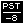
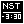
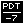

# TimeZone Widget

Widget to report the current timezone's GMT offset and informal name (if known).

Examples:

   

## Usage

Install the widget. It reports passively on the current timezone.

## Features

If a human-readable name is known for the timezone it appears at the top of the widget, separated
from the GMT offset by a bar. Otherwise, GMT ±hh:mm is displayed.

## Controls

None.

## Requests

@stephenPspackman

## Creator

Stephen P Spackman
